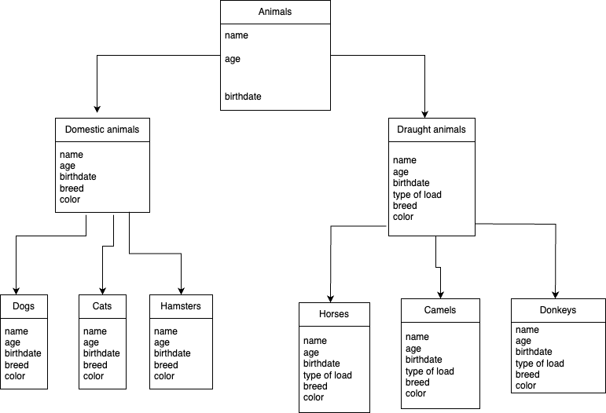

# **Итоговая контрольная работа**

## 1. Используя команду cat в терминале операционной системы Linux, создатьдва файла Домашние животные (заполнив файл собаками, кошками,хомяками) и Вьючные животными заполнив файл Лошадьми, верблюдами и ослы), а затем объединить их. Просмотреть содержимое созданного файла Переименовать файл, дав ему новое имя (Друзья человека).

___

## 2. Создать директорию, переместить файл туда.

___

## 3. Подключить дополнительный репозиторий MySQL. Установить любой пакет из этого репозитория.

___
## 4. Установить и удалить deb-пакет с помощью dpkg.

---

## 5. Выложить историю команд в терминале ubuntu

___
## 6. Нарисовать диаграмму, в которой есть класс родительский класс, домашние животные и вьючные животные, в составы которых в случае домашних животных войдут классы: собаки, кошки, хомяки, а в класс вьючные животные войдут: Лошади, верблюды и ослы.

___
## 7. В подключенном MySQL репозитории создать базу данных “Друзья человека”

## 8. Создать таблицы с иерархией из диаграммы в БД

___
## 9. Заполнить низкоуровневые таблицы именами(животных), командами которые они выполняют и датами рождения

___
## 10. Удалив из таблицы верблюдов, т.к. верблюдов решили перевезти в другой питомник на зимовку. Объединить таблицы лошади, и ослы в одну таблицу.

___
## 11.Создать новую таблицу “молодые животные” в которую попадут все животные старше 1 года, но младше 3 лет и в отдельном столбце с точностью до месяца подсчитать возраст животных в новой таблице

___
## 12. Объединить все таблицы в одну, при этом сохраняя поля, указывающие на прошлую принадлежность к старым таблицам.

___
## 14. Написать программу, имитирующую работу реестра домашних животных.В программе должен быть реализован следующий функционал:
## 14.1 Завести новое животное
## 14.2 определять животное в правильный класс
## 14.3 увидеть список команд, которое выполняет животное
## 14.4 обучить животное новым командам
## 14.5 Реализовать навигацию по меню
